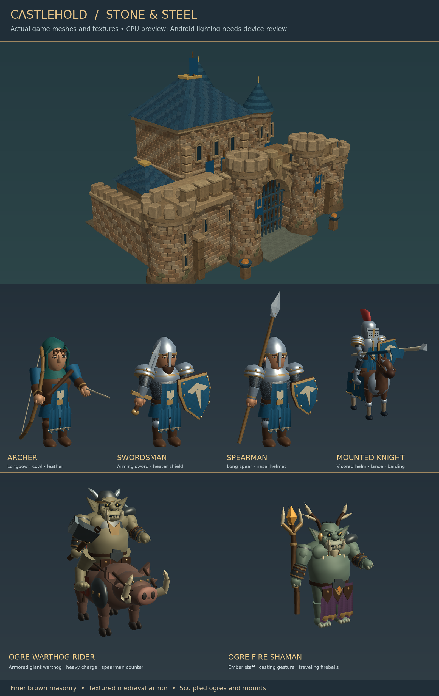

# Castlehold — Warcry 0.4.3

Battle speed is adjustable in-game: tap **Speed** beside Pause to cycle 1×, 1.5× and 2×, or choose a speed directly in Settings. The choice persists between launches, pauses safely at normal clock speed, and restores when combat resumes. Audio pitch stays natural while the battle clock accelerates.

Death sounds now have a fuller, louder vocal body and more upper-frequency detail intended for phone speakers. Each of the human, orc and ogre families has its own voice slot, so other families cannot suppress an ogre grunt. Music and impacts briefly lower around the voices; a final output limiter protects the combined mix. In **Settings**, use **Test human**, **Test orc** and **Test ogre** to hear the actual clips. **Sound effects** and **Mute all audio** control these previews and battle voices.

Bosses deal **15% more damage than 0.4.1**, including charges and specials. Interval income is slightly lower, so replacements compete more strongly with repairs. The unchanged mixed purchase policy wins with 268 recorded casualties and a gate reduced below half HP; see `docs/VALIDATION.md`. Ordinary attacker strength remains 12% above the earlier 0.4.0 baseline.

This complete package retains the detailed brown fortress, medieval defenders, orc/ogre horde, four giant bosses at waves 25/50/75/100, 100 nonstop waves, persistent army, pause/recruitment, finger scouting, adjustable medieval music at a 35% default and selectable battle speed.



The image inspects actual project geometry with approximate lighting. It is not an Android gameplay screenshot. See `docs/WARCRY_UPDATE.md` for this revision and `docs/GRAPHICS_AND_SOUND_UPDATE.md` for the earlier visual changes and `docs/VALIDATION.md` for checks and remaining device review.

## Play

- The first assault begins after a four-second countdown. No BEGIN WAVE button or preparation rounds.
- Reinforcements arrive over **10–15 seconds**, followed by a **3–5 second gap** before the next wave. Existing enemies keep fighting throughout.
- Recruit Archers, Swordsmen, Spearmen and mounted Knights using the bottom cards. Buy replacements or repair the Gate/Keep at any time, including while paused.
- **Pause / Resume** freezes and resumes the wave clock, movement, arrows, fireballs and animations. Switching away from the app also pauses it and suspends audio. Returning restores music; tap Resume when ready to fight.
- **Speed** cycles the live battle clock through 1×, 1.5× and 2×. The same choices are available in Settings and are saved independently from campaign progress. Pause, Settings and result screens remain readable at normal UI speed.
- **Settings** provides Music and Sound effects sliders, a Mute all audio switch, and Test effects. Changes apply immediately and save automatically. Test human/orc/ogre buttons preview death voices while the battle stays paused. The battle pauses while Settings is open; music continues so you can hear your adjustments. Closing Settings or Credits restores the previous pause state.
- Drag empty ground to scout approaching enemies. Tap **Castle** to return home.
- Surviving soldiers heal when the next wave starts. Their positions and combat continue; defeated troops stay lost. Castle damage persists.
- At wave 100, defeat the remaining attackers to win. If the Keep falls, **Retry Wave** restores the latest checkpoint and pauses so you can plan.

Defenders carry visible longbows, swords, heraldic shields, long spears and mounted lances. Enemies have broad jaws, tusks, pointed ears, rough iron and patched rust cloth. Ironshields resist arrows; meet them with swords. Spearmen counter wargs. Knights pursue hunters and shamans along the wings, and archers focus on ogres threatening the gate. Fire shamans first appear at wave 18; warthog riders arrive at wave 25. Their fireballs hit on arrival, with a small blast that damages at most two secondary defenders. The castle uses smaller sandstone courses, beveled blocks, shaped radial turret masonry, an arched gatehouse and a destructible timber gate/portcullis.

## Install from a phone

Download **Castlehold-Battle-Speed-Full.zip**. Upload the ZIP to your current Castlehold repository and open its Codespace. For a fresh installation, use a new repository with **Add a README file** enabled. Paste:

```bash
git pull --ff-only &&
unzip -o Castlehold-Battle-Speed-Full.zip &&
git add project tests docs tools .github README.md FRESH_INSTALL.md GDD.md CHARACTER_ART_BIBLE.md BALANCE.md ANDROID_BUILD.md ASSET_LICENSES.md .gitignore &&
git commit -m "Add selectable battle speed controls" &&
git push
```

This archive contains every source file and game asset, including the Android workflow, directly at repository root. Earlier installs and update archives are not required. GitHub Actions imports the game, runs its checks and builds the APK. Download **Castlehold-Android-debug** from the successful **Add selectable battle speed controls** run, extract it and install `Castlehold-debug.apk`.

See **FRESH_INSTALL.md** for the complete phone setup and **ANDROID_BUILD.md** for signing details. If Android rejects installation over an older copy because of a different debug signature, uninstalling that copy removes its saved progress. Creating a new repository alone does not reset the phone app.

## Run locally

Open `project/project.godot` in Godot 4.7.2. Mobile/Vulkan is the default; a desktop compatibility run can use `--rendering-method gl_compatibility`.

```bash
godot --headless --path project --editor --import
godot --headless --path project --script ../tests/integration.gd -- --test
godot --headless --path project --script ../tests/camera_and_fortress.gd -- --test
godot --headless --path project --script ../tests/graphics.gd -- --test
godot --headless --path project --script ../tests/audio_settings.gd -- --test
godot --headless --path project --script ../tests/battle_speed.gd -- --test
godot --headless --path project --script ../tests/defeat_voices.gd -- --test
godot --headless --path project --script ../tests/horde.gd -- --test
godot --headless --path project --script ../tests/ogre_elites.gd -- --test
godot --headless --path project --script ../tests/bosses.gd -- --test
godot --headless --path project --script ../tests/continuous_siege.gd -- --test
godot --headless --path project --script ../tests/siege_endurance.gd -- --test
godot --headless --path project --script ../tests/siege_endurance.gd -- --test --archers-only
```

## Save behavior

Version 2 checkpoints are written at each wave's start and at final victory. They contain living defenders/enemies, health, positions, gold, castle damage, repair usage, pending reinforcements and wave timing. Closing and reopening resumes that checkpoint paused. A retry also returns to it; transactions made later in the wave roll back together with gold. Existing 0.2.x enemy IDs still load with their replacement art; an older saved interval retains its original spawn cadence. Boss cooldowns, attack warnings and consumed reinforcement thresholds also persist. Earlier version-two saves remain compatible; past boss waves are not replayed retroactively. Arrows/fireballs already in flight and cosmetic debris are transient and are not checkpointed.

A valid earlier First Stand save migrates its gold, garrison and castle condition into the start of the new 100-wave mode. The earlier save file is retained. Atomic writes and a validated backup protect against ordinary interrupted/corrupt saves. An app uninstall removes Android-local saves.

Audio preferences use a separate versioned file, `user://castlehold_settings_v1.cfg`. Music, effects and mute persist across launches and do not roll back with Retry Wave. Invalid settings fall back to safe defaults; level changes use debounced writes and are flushed when Settings closes or the app backgrounds.

## Repository and limits

- `project/resources/waves/siege.json`: runtime pacing, economy, limits and scaling.
- `project/resources/units`, `enemies`: editable troop Resources.
- `tools/build_characters.py`, `tools/build_horde.py`, `tools/build_ogre_elites.py`: reproducible original glTF meshes and humanoid, horse, warg and warthog rigs with animations.
- `tools/build_character_surfaces.py`: three shared original 512² albedo, normal and ORM atlases for skin, cloth, mail, forged metal, leather and wood; all sixteen complete units still use one surface each.
- `tools/build_defeat_voices.py`: nine original short formant-synthesized defeat clips; NumPy/SciPy are optional authoring tools, not runtime dependencies.
- `tools/build_surface_maps.py`: reproducible 256² stone, oak and slate maps plus analytic dust/contact-shadow masks. Optional authoring dependencies: NumPy and Pillow; the game loads prebuilt assets.
- `tools/build_music.py`: original written score and instrument synthesis; optional authoring dependencies are NumPy, SciPy and FFmpeg. The game loads the included 80-second stereo Ogg loop and needs none of these tools. See `docs/MUSIC_UPDATE.md`.
- `tools/build_ogre_audio.py`: original synthesized fire casting and impact sounds, using NumPy.
- `tools/build_bosses.py`: four original bosses, articulated reptile jaws/tails, rider rigs and twelve clips each.
- `tools/build_boss_audio.py`: original giant roar and stone impact synthesis.
- `docs/siege-bosses-review.png`: actual ready-pose boss meshes in a CPU material preview.
- `docs/SIEGE_BOSSES_UPDATE.md`: boss encounters, counters and checkpoint behavior.
- `docs/tusk-and-ember-review.png`: actual posed elite geometry at a shared preview scale.
- `docs/orc-horde-review.png`, `medieval-troops-review.png`, `fortress-review.png`: CPU inspections of actual geometry; **not Android screenshots**.
- `docs/TUSK_AND_EMBER_UPDATE.md`: new elite roles, introductions, fireball behavior and checkpoint compatibility.
- `docs/HORDE_UPDATE.md`: prior enemy redesign and visual fixes.
- `docs/VALIDATION.md`: test evidence and remaining device checks.

No advertisements, online service, paid asset dependency or proprietary engine is required. Frame rate, final lighting and touch feel must still be verified on Android. This is a playable development update; it is not a claim that the complete original commercial-quality brief has shipped.
